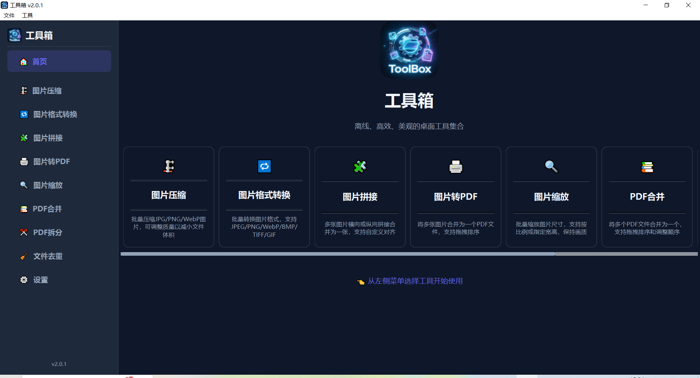
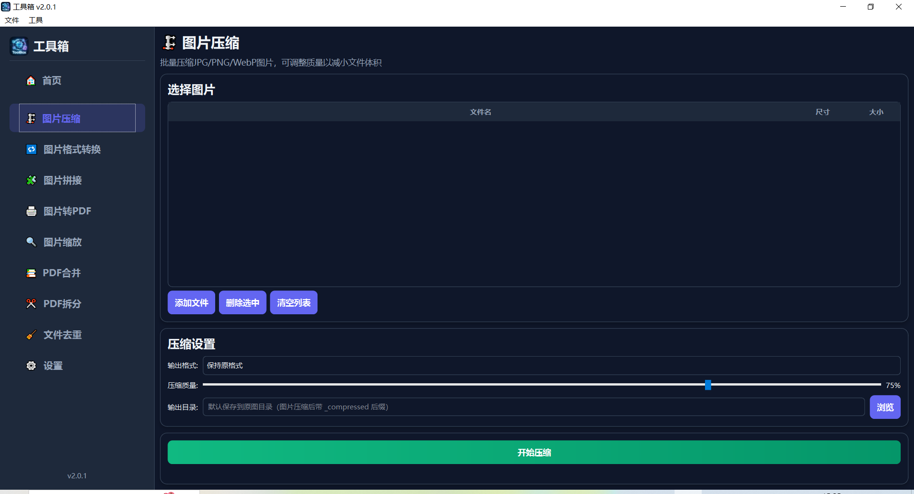
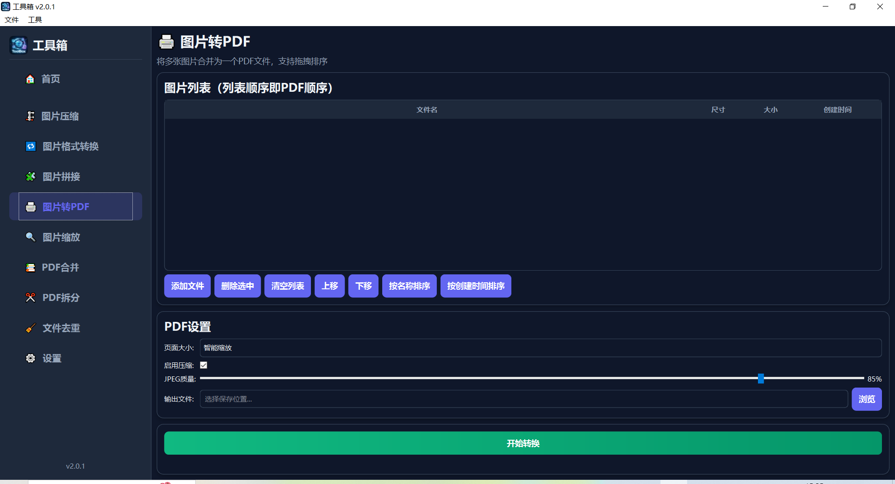
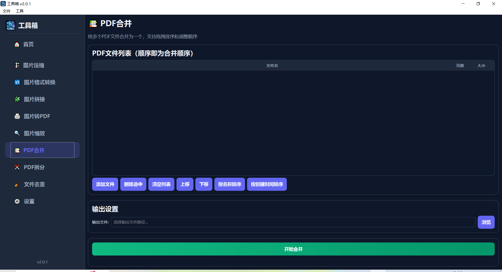
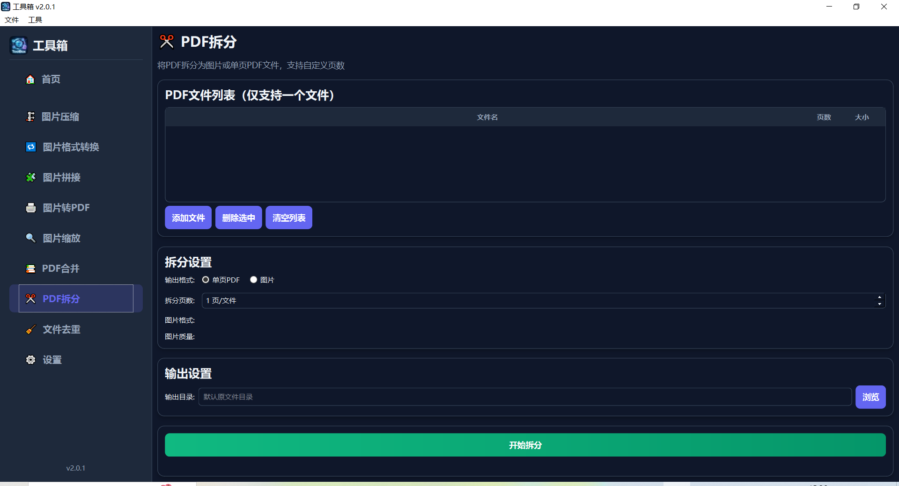
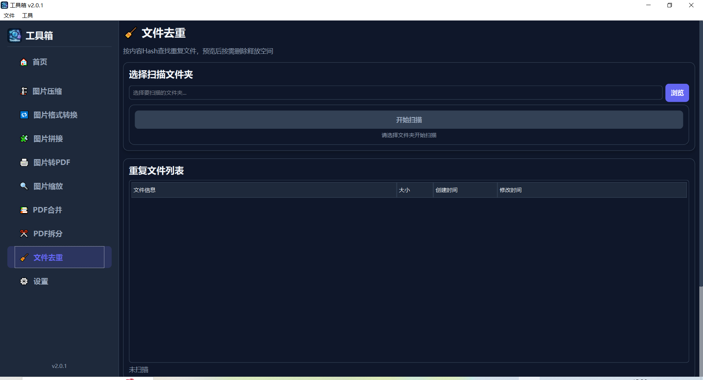
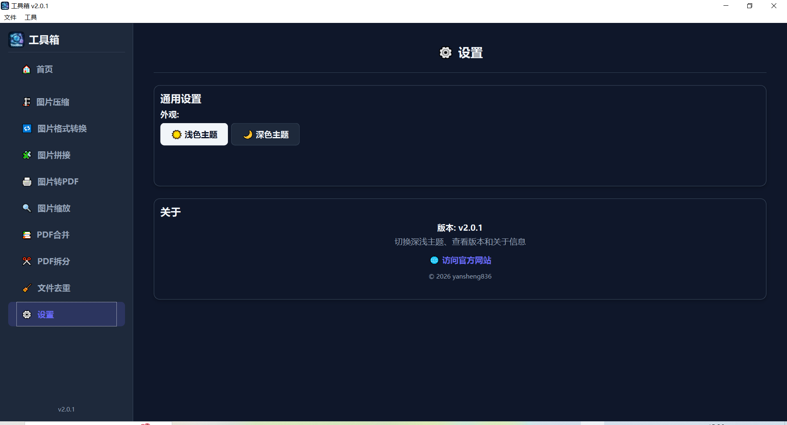

# 工具箱 (ToolBox)

  [](https://github.com/yansheng836/python-toolbox/issues) [](https://github.com/yansheng836/python-toolbox/pulls) [](https://github.com/yansheng836/python-toolbox/tags) [](https://github.com/yansheng836/python-toolbox/releases)   [](https://app.codacy.com/gh/yansheng836/python-toolbox/dashboard?utm_source=gh&utm_medium=referral&utm_content=&utm_campaign=Badge_grade) [](https://github.com/yansheng836/python-toolbox/blob/main/LICENSE.txt)

[](https://github.com/yansheng836/python-toolbox)

<div align="center">
**离线 · 高效 · 美观** 的桌面工具集合

[功能特色](#功能特色) · [截图预览](#截图预览) · [快速开始](#快速开始) · [使用指南](#使用指南) · [插件开发](#插件开发) · [用户手册](用户手册.md)

</div>

---

## 功能特色

| 图标 | 工具 | 说明 |
|:----:|------|------|
| 🗜️ | **图片压缩** | 批量压缩 JPG/PNG/WebP，可调质量，支持格式互转 |
| 🔁 | **图片格式转换** | 批量转换 JPEG/PNG/WebP/BMP/TIFF/GIF 六种格式 |
| 🧩 | **图片拼接** | 多张图片横向或纵向拼成一张，支持对齐设置 |
| 🖨️ | **图片转PDF** | 多张图片合并为一个 PDF，支持拖拽排序 |
| 🔍 | **图片缩放** | 批量调整尺寸，支持按比例/宽度/高度/指定宽高 |
| 📚 | **PDF合并** | 多个 PDF 合并为一个，支持拖拽调整顺序 |
| 📃 | **PDF拆分** | 拆分 PDF 为图片或单页 PDF，支持自定义页数 |
| 🔂 | **文件去重** | 按文件大小预筛选 + 内容 Hash 查找重复文件，支持规则排序预览 |

### 通用特性

- 🌙 **深色/浅色主题** — 一键切换，自动记忆偏好
- 🖱️ **拖拽支持** — 多数工具支持直接拖拽文件到列表
- 📊 **文件列表** — 统一的交互体验，支持添加/移除/排序/清空
- 📈 **进度显示** — 实时显示处理进度和状态
- 🔌 **完全离线** — 所有处理在本地完成，不上传任何数据
- 🧩 **插件扩展** — 放入 `plugins/` 目录即可自动加载
- ↔️ **侧边栏折叠** — 点击折叠按钮或 `Ctrl+B` 快捷键收起/展开侧边栏

---

## 截图预览

| 功能 | 截图 |
|:---:|:---:|
| **首页** |  |
| **图片压缩** |  |
| **图片格式转换** |  |
| **图片拼接** |  |
| **图片转PDF** |  |
| **图片缩放** |  |
| **PDF合并** |  |
| **PDF拆分** |  |
| **文件去重** |  |
| **设置** |  |

---

## 快速开始

### 1. 安装依赖

```bash
pip install -r requirements.txt
```

**依赖包说明：**

| 包 | 用途 |
|----|------|
| PyQt6 | GUI 框架 |
| Pillow (PIL) | 图片处理 |
| img2pdf | PDF 转换（首选） |
| PyMuPDF (fitz) | PDF 转换（备选） |

### 2. 运行程序

```bash
python main.py
```

### 3. 打包为 EXE（Windows）

```bash
# 推荐使用 spec 文件打包（已包含所有必要模块）
pyinstaller toolbox.spec

# 使用 UPX 压缩减小体积
pyinstaller --upx-dir=/path/to/upx toolbox.spec
```

> ⚠️ **注意**：必须使用 `toolbox.spec` 进行打包，直接运行 `pyinstaller main.py` 会导致动态加载的插件模块缺失。

---

## 使用指南

### 图片压缩

1. 点击左侧「图片压缩」
2. 添加图片（支持多选和拖拽）
3. 选择输出格式（保持原格式 / JPG / PNG / WebP）
4. 调整压缩质量滑块（建议 70~85%）
5. 点击「开始压缩」

### 图片格式转换

1. 点击左侧「图片格式转换」
2. 添加图片，选择目标格式（JPEG / PNG / WebP / BMP / TIFF / GIF）
3. 调整转换质量
4. 点击「开始转换」

### 图片拼接

1. 点击左侧「图片拼接」
2. 添加图片（至少 2 张），调整顺序
3. 选择拼接方向：横向 / 纵向
4. 设置输出图片质量
5. 点击「开始拼接」

### 图片转PDF

1. 点击左侧「图片转PDF」
2. 添加图片（支持拖拽排序）
3. 选择输出质量（高质量 / 标准 / 压缩）
4. 选择输出文件路径
5. 点击「开始转换」

### 图片缩放

1. 点击左侧「图片缩放」
2. 添加图片，选择缩放方式（百分比 / 宽度 / 高度 / 指定宽高）
3. 设置缩放参数，勾选「保持宽高比」
4. 点击「开始缩放」

### PDF合并

1. 点击左侧「PDF合并」
2. 添加 PDF 文件（支持拖拽排序）
3. 调整 PDF 顺序（上移 / 下移）
4. 选择输出文件路径
5. 点击「开始合并」

### PDF拆分

1. 点击左侧「PDF拆分」
2. 添加一个 PDF 文件
3. 选择输出格式（单页 PDF / 图片）
4. 设置拆分页数（单页 PDF 模式）或图片格式（图片模式）
5. 点击「开始拆分」

### 文件去重

1. 点击左侧「文件去重」
2. 选择要扫描的文件夹，自动开始扫描（三级过滤：文件大小→快速Hash→完整Hash，大幅提速）
3. 选择去重规则，点击「按规则排序」预览保留/删除标记
4. 确认无误后勾选要删除的分组
5. 点击「删除重复文件」并确认

---

## 插件开发

工具箱支持插件扩展，将 Python 文件放入 `plugins/` 目录即可自动加载。

### 创建插件

新建 `plugins/my_tool.py`：

```python
# -*- encoding: utf-8 -*-
"""
我的工具插件
"""
from toolbox import ToolPlugin, Card, AnimatedButton, Theme
from PyQt6.QtWidgets import QWidget, QVBoxLayout, QLabel

class MyTool(ToolPlugin):
    name = "我的工具"
    description = "工具描述"
    icon = "🔧"

    def create_ui(self) -> QWidget:
        """创建工具界面"""
        widget = QWidget()
        layout = QVBoxLayout(widget)
        layout.addWidget(QLabel("Hello, World!"))
        return widget

    def update_theme(self, theme):
        """响应主题切换（必须实现）"""
        pass
```

### 插件配置

在 `config.py` 的 `PLUGIN_MODULES` 列表中添加配置：

```python
PLUGIN_MODULES = [
    # ... 其他插件 ...
    {
        "name": "我的工具",
        "icon": "🔧",
        "description": "工具描述",
        "order": 30,  # 排序权重，越小越靠前
        "module": "plugins.my_tool",
        "class": "MyTool",
    },
]
```

### 现有插件

| 文件 | 类名 | 功能 |
|------|------|------|
| `plugins/image_compressor.py` | `ImageCompressor` | 图片压缩 |
| `plugins/image_format_converter.py` | `FormatConverter` | 图片格式转换 |
| `plugins/image_stitcher.py` | `ImageStitcher` | 图片拼接 |
| `plugins/image_to_pdf.py` | `ImageToPDF` | 图片转 PDF |
| `plugins/image_scaler.py` | `ImageScaler` | 图片缩放 |
| `plugins/pdf_merger.py` | `PDFMerger` | PDF 合并 |
| `plugins/pdf_splitter.py` | `PDFSplitter` | PDF 拆分 |
| `plugins/file_deduplicator.py` | `FileDeduplicator` | 文件去重 |

---

## 配置系统

应用配置集中在 `config.py` 文件中：

| 配置项 | 说明 |
|--------|------|
| `APP_NAME`, `APP_VERSION` | 应用名称和版本号 |
| `APP_DESCRIPTION`, `APP_COPYRIGHT` | 应用描述和版权信息 |
| `APP_WEBSITE_URL` | 官方网站链接 |
| `PLUGIN_MODULES` | 插件列表（名称、图标、描述、排序） |
| `UI_CONFIG` | 窗口大小、侧边栏宽度等 UI 设置 |
| `THEME_CONFIG` | 主题相关配置 |
| `WELCOME_CONFIG` | 欢迎页面文本内容 |

修改 `config.py` 即可自定义应用外观和信息，无需修改主程序代码。

---

## 打包发布

### 环境要求

- Python 3.8+
- Windows 系统（其他平台可修改 spec 后尝试）

### 打包步骤

```bash
# 1. 生成版本信息文件
python generate_version_info.py

# 2. 验证打包依赖
python verify_packaging.py

# 3. 打包为 EXE
pyinstaller toolbox.spec
```

打包后的 EXE 文件位于 `dist/` 目录下。

---

## TODO

### 已完成 ✅

- [x] 图片压缩（批量，可调质量）
- [x] 图片格式转换（JPEG/PNG/WebP/BMP/TIFF/GIF）
- [x] 图片拼接（横向/纵向）
- [x] 图片转 PDF（多图合成）
- [x] 图片缩放（百分比/指定宽高）
- [x] PDF 合并（多文件合并）
- [x] PDF 拆分（拆成图片或单页 PDF）
- [x] 文件去重（按内容 Hash）
- [x] 深色/浅色主题切换
- [x] 插件自动发现和加载

### 计划中 🔨

- [ ] 图片批量水印（文字或图片水印）
- [ ] 图片批量旋转/翻转
- [ ] 图片批量裁剪
- [ ] 文件批量重命名（正则、序号、日期规则）

### 待优化功能

暂无

---

欢迎提交 PR 贡献新插件或功能！

---

## 许可证

本项目为开源项目，使用[MIT协议](./LICENSE.txt)，欢迎自由使用和贡献。

## Star History

[](https://star-history.com/#yansheng836/python-toolbox&Timeline)

## Visitors

<a href="https://info.flagcounter.com/nYwQ"></a>

---

<div align="center">
**工具箱** — 让文件处理更简单 🚀
</div>
